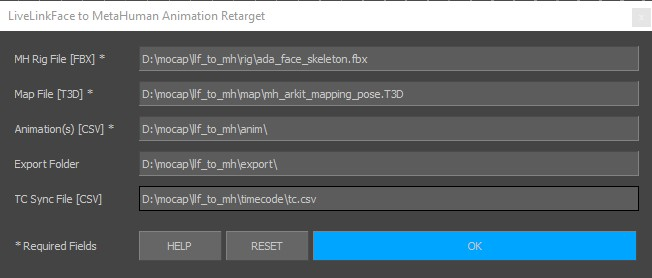
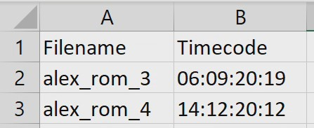

# Live Link Face to Unreal MetaHuman
*Retarget facial animations recorded with the Live Link Face app onto an Unreal MetaHuman character, using MotionBuilder and Python.*

## Description
This motionbuilder script will open the CSV files created by the Live Link Face app and extract the facial animation in the form of blendshape/timecode values. Using the T3D mapping file from Unreal, it will create connections between the ARKit blendshapes used by the app and the custom properties used by Unreal to drive your MetaHuman’s face. It will then load your MH rig and retarget the facial motion onto it before exporting it as an fbx file, ready to be used in Unreal. The script can also operate in batch mode over multiple CSV files.

## Requirements and installation
Hardware:
+ An iPhone 10 or superior (supported by Live Link Face) and connected to the same network or to the PC via USB.

Software:
+ [Motionbuilder](https://www.autodesk.com/products/motionbuilder/) version 2022 / python3 (to be tested on earlier versions with python2)
+ [Unreal Engine](https://www.unrealengine.com/en-US/) version 4.XX
+ [Live Link Face](https://apps.apple.com/us/app/live-link-face/id1495370836) available for free on the app store
+ [Quixel Bridge](https://quixel.com/bridge) if you want to export your MH to Unreal after creation

Libraries:
+ Pandas for CSV extraction

See [Autodesk documentation](https://knowledge.autodesk.com/support/motionbuilder/learn-explore/caas/CloudHelp/cloudhelp/2022/ENU/MotionBuilder/files/GUID-46E090C5-34AD-4E26-872F-F7D21DC57C74-htm.html) on adding libraries to motionbuilder using mobupy.

## Script contents
The script relies on the following files:
+ **run.py**: Entry point, displays the UI when calling main()
+ **ui.py**: UI file, creates and displays the UI, collects information and start the retargeting process
+ **ctrl.py**: Defines the BlendShape class and methods to parse the T3D map file and CSV animation and timecode files. Batch retargets the animations onto the MH rig file and exports FBXs.
+ **data.json**: Optional file, saves the current user input or loads the latest one
The anim, export, map, rig and timecode directories are just for testing and can be moved anywhere, as long as their content is entered correctly in the UI fields.

## How to run the script
Drag-and-drop and execute **run.py** in MotionBuilder, or open it in the Python Editor and run it. It will call the **main()** function and display the UI. Fill up the required fields and click **OK** to start the retargeting batch.
Alternatively you can call **main()** from a menu element or a shortcut.

## UI description
The script offers a basic UI to enter the required and optional paths.

### Required fields
+ **MH Rig File [FBX]**: path to your Unreal MetaHuman skeleton. You can use the one from Ada in the rig folder, which I exported from the [MetaHuman project](https://www.unrealengine.com/marketplace/en-US/product/metahumans).
+ **Map File [t3D]**: path to your map file exported from unreal. You can use the one from the map folder, which I exported from that same project.
+ **Animation(s) [CSV]**: path to an animation file created by Live Link Face. You can specify a directory with multiple files to run the batch on all of them
### Optional fields:
+ **Export Folder**: path to the folder where fbx animations should be exported. If not specified, takes will be saved in the Animation folder, in an Export subfolder.
+ **TC Sync File [CSV]**: path to a CSV file specifying for each take the starting timecode for synchronisation. If not specified, the animation file timecode will be used.
### Buttons:
+ **Help**: Opens this page
+ **Reset**: Delete all the entries
+ **OK**: Start the batch process

## How to record animations using the Live Link Face app
See the app's [documentation](https://docs.unrealengine.com/4.27/en-US/AnimatingObjects/SkeletalMeshAnimation/FacialRecordingiPhone/) on how to connect to your Unreal metahuman character and drive its face in real-time.

## How the script is working
Here are the basic steps the script is going through:
1. Run the UI and store the input paths
2. Parse the T3D map file from Unreal and create BlendShape instances for all the ARKit shapes found. A BlendShape instance is defined by its name, a dictionary mapping this shape to the corresponding weighted metahuman properties, and a dictionary of timecode/values for the current animation being processed.
3. Load the MH rig. Opens the current CSV animation file. For each custom property found on the root join (CTRL_XXX shapes and head_ xxx correctives), go through the list of BlendShape instances created at step 2. If an ARKit shape should influence this custom property, calculate and key the weighted values for this property and for all frames. Then move on to the next custom property, and so on. If a CSV Sync File is specified, the timecode used to key the values will be offset to start at the given timecode.
4. Set up the working timespan (frames in and out), then save the FBX file.
5. If you specify a directory of CSV files (batch mode), the script will go through step 3 and 4 for all of them.

The exported FBX files can be imported into Unreal and directly applied to the MetaHuman Face skeleton.

## Optional: How to offset/sync animations
If you recorded an smtp timecode in the video container or on the audio channel, you can use this value to offset the animation at retargeting. Create for this a CSV file (or use **the one** from the timecode directory) and specify for each filename the timecode it should start at. 
If you recorded an smtp timecode on the audio channel, you can use a software like the [Tentacle Timecode Tool](https://tentaclesync.com/timecode-tool) to read it and export it as CSV.
Be careful to use the exact headers **Filename** and **Timecode**, and specify your filenames without extension.

## Optional: Save and Load
To speed up the process of entering all the paths, the script is using a data.json file at the root of the project. The script automatically loads the 5 fields at startup and saves them when clicking OK. Feel free to comment the load_data() and save_data() functions to get rid of this feature. On the other hand, you can save versions of data.json corresponding to different projects if it helps.

## Additional help and resources
[MetaHuman documentation](https://www.unrealengine.com/en-US/digital-humans)

[Live Link Face documentation](https://docs.unrealengine.com/4.27/en-US/AnimatingObjects/SkeletalMeshAnimation/FacialRecordingiPhone/)

[ARKit blendshape description](https://developer.apple.com/documentation/arkit/arfaceanchor/blendshapelocation)
